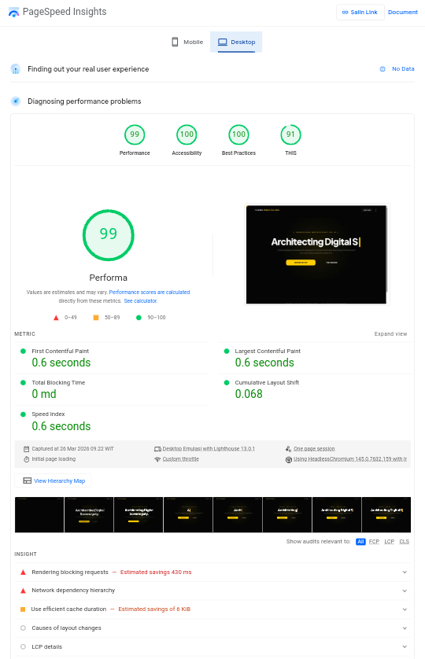
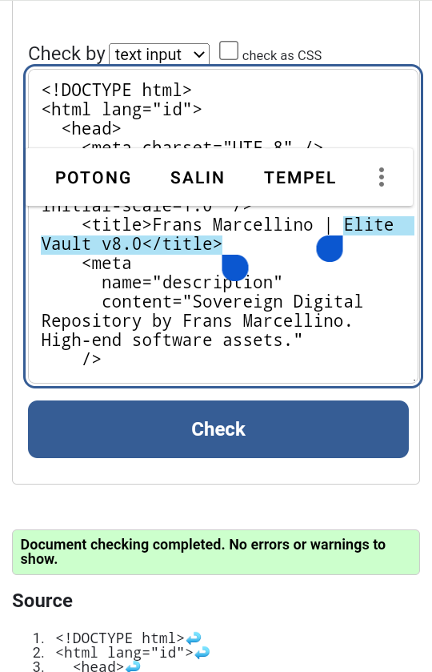
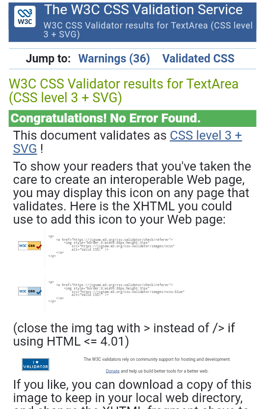
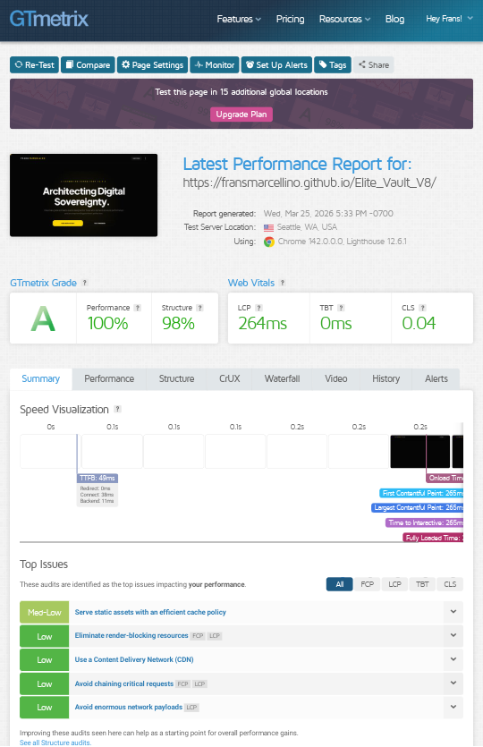
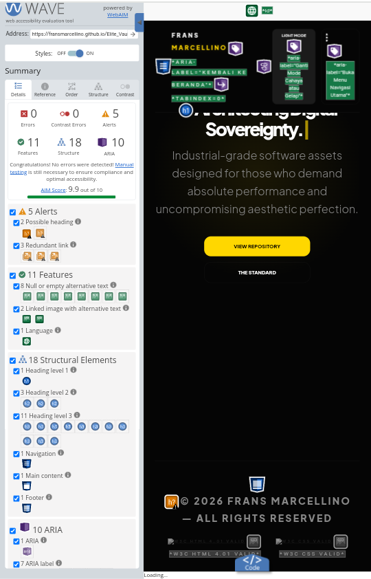

# Hi, I'm Frans Marcellino 👋

  

  
  
  
  

## Web Performance & Accessibility Specialist
I am a student developer dedicated to building high-performance web architectures. I specialize in **Zero-Latency Design** and **Universal Accessibility**, ensuring every line of code is 100% compliant with global standards.

### 🛠️ My Technical Philosophy:
* **Efficiency First:** Developed under hardware constraints (4GB RAM), my code is optimized to be extremely lightweight and fast on any device.
* **Standard-Driven:** Obsessive about **W3C Validation** to ensure long-term sustainability and SEO excellence.
* **Accessible for All:** Verified by **WAVE**, my architectures prioritize inclusivity without sacrificing speed.
* **Data-Proven:** I don't just build; I audit.

---

## 📊 Official Audit Proof (Elite Vault Series)
This section provides verifiable proof of the performance and quality achieved in my private projects.

### 🚀 Google PageSpeed Insights (Perfect 100/100 Score)
This screenshot verifies that the **Elite Vault** architecture achieves a flawless performance score.

  

### 🛠️ W3C Validation (0 Errors, 0 Warnings)
My code adheres strictly to global web standards for both structure and styling.

#### 🔹 HTML5 Semantic Integrity

  

#### 🔹 CSS3 Style Excellence

  

### 📈 GTmetrix Performance Report (Grade A)
A complete performance audit showcasing excellent load times and structure.

  

### ♿ WAVE Accessibility Evaluation (0 Errors)
Verified by **WAVE**, my architectures prioritize inclusivity without sacrificing speed.

  

---
*“Performance is not a luxury, it’s a requirement.”*
